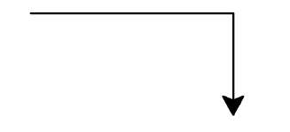
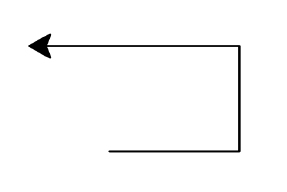
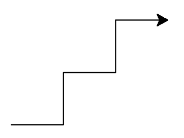
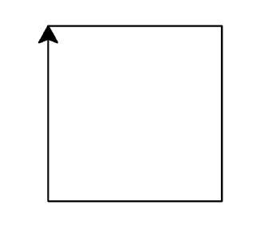
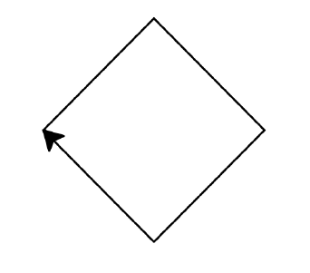
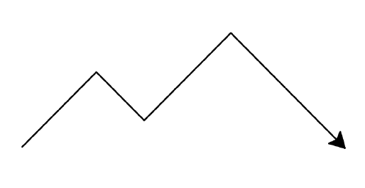

---
jupyter:
  jupytext:
    formats: ipynb,md
    split_at_heading: true
    text_representation:
      extension: .md
      format_name: markdown
      format_version: '1.3'
      jupytext_version: 1.13.6
  kernelspec:
    display_name: Python 3 (ipykernel)
    language: python
    name: python3
---

<!-- LTeX: language=fr -->
<!-- #region slideshow={"slide_type": "slide"} -->
Cours 3 : Dessiner avec `turtle`
================================

**Loïc Grobol** [<lgrobol@parisnanterre.fr>](mailto:lgrobol@parisnanterre.fr)

<!-- #endregion -->

Dans ce notebook :

- Utiliser une console interactive Python
- Dessiner avec le module [`turtle`](https://docs.python.org/3/library/turtle.html)
- Créer et exécuter des scripts Python avec [Thonny](https://thonny.org/)

Matériel complémentaire : [une vidéo pertinente](https://youtu.be/FN2RM-CHkuI).

Les exercices sont tirés du cours « Apprendre à programmer avec Python », donné à l'Université
Sorbonne Nouvelle par Marine Delaborde et Pascal Amsili, que je remercie très chaleureusement.

## Thonny

[Thonny](https://thonny.org/) est un **environnement de programmation** Python à destination des
débutant⋅es, mais complet et qui offre de nombreuses fonctionnalités utiles, y compris assez
avancées.

Si vous n'avez pas encore installé [Thonny](https://thonny.org/), faites-le tout de suite en suivant
le lien dans cette phrase.

Au démarrage de Thonny, la fenêtre affiche deux blocs, un bloc avec un onglet d'édition de texte
dont on va bientôt parler, et un bloc nommé « Console » qui affiche quelque chose comme

```text
Python 3.10.1 (/usr/bin/python)
>>> 
```

Si vous cliquez dans ce bloc, vous verrez que votre curseur clignote après `>>>` (l'« invite de
commande ») et que vous pouvez y entrer du texte.

Tapez `print("Hello, world!")` et appuyez sur entrée. Que se passe-t-il ?


Ce bloc « Console » vous permet d'entrer des instructions en Python et de les voir directement
exécutées, le résultat s'affichant en dessous de votre instruction, comme quand vous exécutez une
cellule dans un notebook. C'est ce qu'on appelle une _**R**ead **E**val **P**rint **L**oop_ ou REPL.


Testez l'usage de la fonction `input()` en vous en servant pour stocker une valeur dans une variable
nommée `spam`, puis affichez la valeur de `spam` avec la fonction `print()`.

## Turtle

<!-- #region -->
Entrez les commandes suivantes dans la console :

```python
from turtle import *
shape("turtle")
```

Que se passe-t-il ?
<!-- #endregion -->

<!-- #region -->
Entrez à présent

```python
forward(100)
```

Qu'est-ce qui a changé ?
<!-- #endregion -->

<!-- #region -->
Enfin, essayez

```python
left(90)
forward(100)
```
<!-- #endregion -->

Vous l'aurez compris, on peut ainsi dessiner avec Python et une adorable tortue. Voici quelques
commandes de base :

- `forward(d)` avance de d pixels
- `backward(d)` recule de d pixels
- `left(a)` pivote vers la gauche de a degrés
- `right(a)` pivote vers la droite de a degrés
- `up()` relève le crayon pour avancer sans dessiner
- `down()` abaisse le crayon pour dessiner
- `reset()` remet le dessin à zéro
- `circle(r, a)` trace un arc de cercle de rayon `rayon` et d'angle `a` degrés. `a` est facultatif
  et vaut `360` par défaut (soit un cercle entier).

## 🐢 Exo 🐢

(Pour garder trace des instructions que vous utilisez, vous pouvez les copier-coller dans la zone
d'édition de Thonny, au dessus de la console).

### Exercice 1

Reproduire la forme suivante à l’aide des fonctions `turtle`. La ligne horizontale fait 100 pixels,
la ligne verticale fait 50 pixels, l’angle est un angle droit :



### Exercice 2

Reproduire la forme suivante à l’aide des fonctions `turtle` (les segments font respectivement 57,
46 et 92 pixels) :



### Exercice 3

Reproduire la forme suivante à l’aide des fonctions `turtle` (escalier montant dont les marches font
(45×45 pixels)).



### Exercice 4

Dessiner un carré de 96 pixels de côté.



### Exercice 5

Reproduire la forme suivante à l’aide des fonctions `turtle` (dimensions des segments : 76px)



<!-- #region -->
## Scripts

Un truc frustrant dans tout ça, c'est de devoir écrire les instructions une par une et pas en bloc
comme dans les notebooks.

<small>En fait on peut, mais chut</small>

Pourquoi on utiliserait pas un notebook alors ?

Les notebooks c'est très bien pour faire des démonstrations ou du travail exploratoire, mais

- Ça demande soit un accès à un service en ligne (Binder, Colab…) ou une installation en local assez
  lourde.
- Ce n'est pas exécutable de manière autonome.
- Le format des fichiers n'est pas très ergonomique, ce qui apporte un certain nombre de
  complications.
- `turtle` n'y marche pas très bien 😠

Un autre façon d'utiliser Python c'est avec des **scripts** : des fichiers contenant des programmes
exécutables directement sur vos machines. Le volet d'édition de Thonny sert à écrire des scripts :
essayez d'entrer les instructions suivantes dedans

```python
from turtle import *
shape("turtle")

forward(100)
right(90)
forward(50)
```

Sauvegarder sur votre machine dans un fichier (l'extension conventionnelle est `.py`), puis cliquez
sur le bouton ▶️.

<!-- #endregion -->

Les notebooks et les scripts ont chacun leurs avantages et leurs inconvénients, mais il est
important de savoir utiliser les deux. À l'avenir on alternera donc entre les deux pour vous y
habituer.

### Exercice 6

Écrire un script Python qui reproduit la forme suivante à l’aide des fonctions `turtle` (dimensions
des segments : 65px, 42px, 76px, 100px).



### Exercice 7

Dessiner avec `turtle` une maison d’enfant (sans perspective : un toit, une porte, une fenêtre, une
cheminée).

## Et après ?

On retrouvera la tortue dans des prochaines séances. Quelques notes pour celleux qui voudraient
aller plus loin tout de suite, la documentation complète de `turtle` avec toutes ses commandes est
disponible à <https://docs.python.org/fr/3/library/turtle.html>. Attention, elle ne prend pas trop
de pincettes.

Et qu'est-ce que c'est que cette histoire de `from turtle import *` ? C'est une histoire pour une
prochaine fois.
