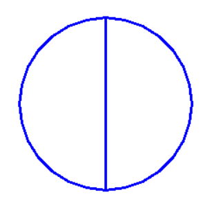
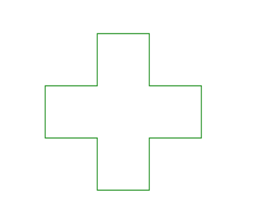
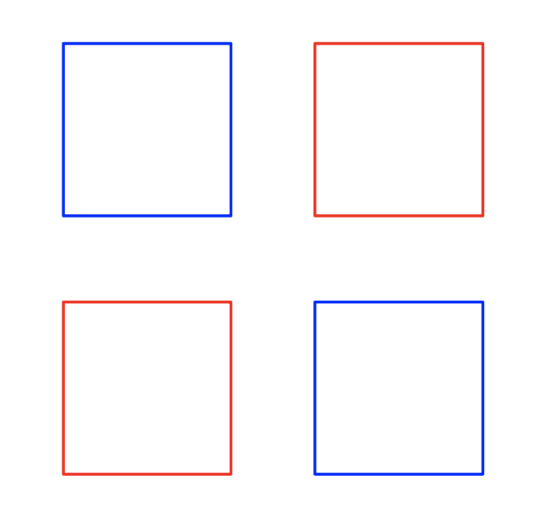

---
jupyter:
  jupytext:
    formats: ipynb,md
    split_at_heading: true
    text_representation:
      extension: .md
      format_name: markdown
      format_version: '1.3'
      jupytext_version: 1.14.5
  kernelspec:
    display_name: Python 3 (ipykernel)
    language: python
    name: python3
---

<!-- #region slideshow={"slide_type": "skip"} -->
<!-- LTeX: language=fr -->
<!-- #endregion -->
<!-- #region slideshow={"slide_type": "slide"} -->
Cours 9 : Fonctions
===================

**Loïc Grobol** [<lgrobol@parisnanterre.fr>](mailto:lgrobol@parisnanterre.fr)

<!-- #endregion -->

<!-- #region slideshow={"slide_type": "subslide"} -->
Dans ce notebook

- On retrouve la tortue !
- Écrire ses propres fonctions

Les exercices sont tirés du cours « Apprendre à programmer avec Python », donnée à l'Université
Sorbonne Nouvelle par Marine Delaborde et Pascal Amsili, que je remercie très chaleureusement.
<!-- #endregion -->

<!-- #region slideshow={"slide_type": "slide"} -->
## Rappel chéloniens

Le module Python `turtle` permet de dessiner simplement en Python, en contrôlant un agent qui laisse
une trace sur une toile. `turtle` parce que ça fait comme une tortue qui aurait marché dans de la
peinture.
<!-- #endregion -->

<!-- #region slideshow={"slide_type": "subslide"} -->
`turtle` ne marche pas vraiment dans l'interface Jupyter Notebook. Pour ce qui suit, vous devrez
donc travailler soit dans un environnement de programmation Python local (par exemple
[Thonny](https://thonny.org/)), soit avec l'environnement en ligne [repl.it](repl.it) (pensez à bien
sélectionner le mode Python `turtle`). Pour le fonctionnement de Thonny, vous pouvez revenir au
[cours 2](../02-turtle/turtle.py.md).

Rappel : c'est en général plus agréable dans ce genre de cas d'utiliser des **scripts**: des
fichiers textes avec l'extension `.py` qui contiennent des programmes. Vous pouvez les ouvrir dans
Thonny (où ils s'affichent dans la zone d'édition) et les exécuter avec le bouton ▶️.
<!-- #endregion -->

<!-- #region slideshow={"slide_type": "subslide"} -->
Les commandes de base en `turtle` :

- `forward(d)` avance de d pixels
- `backward(d)` recule de d pixels
- `left(a)` pivote vers la gauche de a degrés
- `right(a)` pivote vers la droite de a degrés
- `up()` relève le crayon pour avancer sans dessiner
- `down()` abaisse le crayon pour dessiner
- `reset()` remet le dessin à zéro
- `circle(r, a)` trace un arc de cercle de rayon `rayon` et d'angle `a` degrés. `a` est facultatif
  et vaut `360` par défaut (soit un cercle entier).
- `pensize(e)` épaisseur du tracé (pixels)
- `color(couleur)` couleur du tracé (par exemple `color("blue")`).
<!-- #endregion -->

<!-- #region slideshow={"slide_type": "subslide"} -->
## 🐢 Exo 🐢
<!-- #endregion -->

<!-- #region slideshow={"slide_type": "subslide"} -->
### Exercice 1

À l'aide des fonctions `turtle`, dessiner un carré de côté 100 pixels.
<!-- #endregion -->

<!-- #region slideshow={"slide_type": "subslide"} -->
### Exercice 2

Reproduire la forme suivante à l’aide des fonctions `turtle`. Le cercle fait 100 pixels de rayon. Le
tracé est bleu et l’épaisseur du trait est de 3 pixels :


<!-- #endregion -->

<!-- #region slideshow={"slide_type": "subslide"} -->
### Exercice 3

Reproduire la forme suivante à l’aide des fonctions `turtle`. Les segments font 60 pixels, le tracé
est en vert et d'épaisseur 3 pixels.


<!-- #endregion -->

<!-- #region slideshow={"slide_type": "subslide"} -->
### Exercice 4

Reproduire la forme suivante à l’aide des fonctions `turtle`. Chaque carré mesure 60 pixels de côté
et il y a 30 pixels entre les carrés.


<!-- #endregion -->

<!-- #region slideshow={"slide_type": "slide"} -->
## J'en ai marre de faire des copier-coller !

Est-ce que vous avez trouvé ces exercices **désagréables** ?
<!-- #endregion -->

<!-- #region slideshow={"slide_type": "fragment"} -->
Moi oui ! On a du écrire quatre fois les mêmes instructions pour dessiner un carré. Certes on peut
faire des copier-coller, mais c'est pénible. Et il se passe quoi si on a plus de carrés ?
<!-- #endregion -->

<!-- #region slideshow={"slide_type": "subslide"} -->
On aurait aussi peut-être pu s'en sortir avec une boucle, mais ça aurait été compliqué.
<!-- #endregion -->

<!-- #region slideshow={"slide_type": "fragment"} -->
En fait ce qu'il faudrait c'est une façon de sauvegarder une suite d'instructions et de pouvoir les
exécuter quand on veut. Comme ça il ne nous serait plus resté que le code pour positionner la tortue
au point de départ.
<!-- #endregion -->

<!-- #region slideshow={"slide_type": "subslide"} -->
Bonne nouvelle : ça existe, et vous l'utilisez déjà, peut-être sans le savoir.
<!-- #endregion -->

<!-- #region slideshow={"slide_type": "fragment"} -->
Ce qu'il nous faut, ce sont des **fonctions**.
<!-- #endregion -->

<!-- #region slideshow={"slide_type": "slide"} -->
## Les fonctions

### De vieilles connaissances

Vous connaissez déjà les fonctions
<!-- #endregion -->

```python slideshow={"slide_type": "fragment"}
print("Hello les potos !")
```

<!-- #region slideshow={"slide_type": "subslide"} -->
Vous connaissez `len`.
<!-- #endregion -->

```python
len("hello")
```

```python
len([1, 2, 3])
```

```python
len({"Cats": "beautiful", "Python": "ton meilleur ami"})
```

<!-- #region slideshow={"slide_type": "subslide"} -->
Vous connaissez `float`, et `int` et `str`
<!-- #endregion -->

```python
float(1)
```

```python
int("364")
```

```python
str(1)
```

<!-- #region slideshow={"slide_type": "subslide"} -->
Vous connaissez `str.upper` et bien d'autres
<!-- #endregion -->

```python
str.upper("aaaaaaaaaaaah!")
```

<!-- #region slideshow={"slide_type": "subslide"} -->
Et vous connaissez les fonctions de `turtle` qu'on vient de voir.

Mais c'est quoi, en vrai, une fonction ?

Et est-ce qu'on peut en faire nous même ?
<!-- #endregion -->

<!-- #region slideshow={"slide_type": "slide"} -->
### Définir des fonctions
<!-- #endregion -->

```python
def say_hello():
    print("Bonjour")

print("On va dire bonjour")
say_hello()
print("Encore")
say_hello()
```

<!-- #region slideshow={"slide_type": "subslide"} -->
Une fonction, c'est un bloc de code, une série d'instructions, un bout de programme auquel on donne
un nom pour pouvoir le réutiliser. Dans la cellule ci-dessus, on a donné le nom `say_hello` à un
morceau de code qui ne contient qu'une seule instruction `print("Bonjour")`.
<!-- #endregion -->

<!-- #region slideshow={"slide_type": "fragment"} -->
Par la suite, à chaque fois qu'on écrit l'instruction `say_hello()`, ce morceau de code a été exécute. On dit qu'on a **appelé** la fonction `say_hello`.
<!-- #endregion -->

<!-- #region slideshow={"slide_type": "subslide"} -->
On peut le faire pour plusieurs instructions
<!-- #endregion -->

```python slideshow={"slide_type": "subslide"}
def sing():
    print("Alo")
    print("Salut")
    print("Sunt eu")
    print("un haiduc")

sing()
sing()
```

<!-- #region slideshow={"slide_type": "subslide"} -->
Note : dans un notebook, comme pour les variables, les fonctions définies dans une cellule sont
accessibles dans les autres cellules :
<!-- #endregion -->

```python
say_hello()
```

<!-- #region slideshow={"slide_type": "subslide"} -->
On définit une fonction à l'aide du mot-clé `def`, qui introduit un bloc d'instructions (le
**corps** de la fonction), qui seront celles liées au nom donné. Formellement :

```python
def <nom de la fonction>():
    <instruction 1>
    <instruction 2>
    …
```
<!-- #endregion -->

<!-- #region slideshow={"slide_type": "subslide"} -->
On peut mettre absolument n'importe quelle suite d'instructions dans le corps d'une fonction :
<!-- #endregion -->

Utiliser des variables

```python
def calculer():
    un_nombre = 2713
    print(2*un_nombre)
    
calculer()
```

<!-- #region slideshow={"slide_type": "subslide"} -->
Et des structures
<!-- #endregion -->

```python
def tests():
    print("On va calculer un truc")
    if 2713/2 < 1000:
        print("lol")
    else:
        print("mdr")

tests()
tests()
```

```python slideshow={"slide_type": "subslide"}
def boucles():
    for mot in ["Python", "c'est", "trop", "bien"]:
        print(mot)
    print()

boucles()
boucles()
boucles()
```

<!-- #region slideshow={"slide_type": "subslide"} -->
En revanche les variables définies à l'intérieur d'une fonction ne sont pas accessibles à l'extérieur de celle-ci
<!-- #endregion -->

```python
def calculer():
    un_nombre = 2713
    print(2*un_nombre)
    
calculer()
print(un_nombre)
```

<!-- #region slideshow={"slide_type": "subslide"} -->
**REMARQUE IMPORTANTE** comme tous les noms que vous donnez en Python, que ce soit à des variables
ou à des fonctions, Python n'attache aucune signification au nom d'une fonction : du point de vue de
Python, les trois fonctions suivantes sont complètement équivalentes.
<!-- #endregion -->

```python slideshow={"slide_type": "subslide"}
def f():
    print("machin")

def machin():
    print("machin")

def une_fonction_avec_un_nom_très_très_long():
    print("machin")
    
machin()
f()
une_fonction_avec_un_nom_très_très_long()
```

<!-- #region slideshow={"slide_type": "subslide"} -->
En général on essaie de donner aux fonctions — comme aux variables — un nom **descriptif**, qui dit
ce que fait la fonction. Ça rend le code plus lisible pour les humains (dont vous) qui liront votre
code. Mais Python n'en a absolument rien à cirer et son comportement sera toujours le même, quel que
soit le nom que vous donnez.
<!-- #endregion -->

<!-- #region slideshow={"slide_type": "slide"} -->
### 🟠 Entraînements 🟠

1\. Écrire un programme dans lequel

- Vous définissez une fonction nommée `dire_bonjour` qui affiche `"Bonjour les ami⋅es !"`.
- Vous appelez trois fois cette fonction.
<!-- #endregion -->

```python

```

<!-- #region slideshow={"slide_type": "subslide"} -->
2\. Écrire un programme dans lequel

- Vous définissez une fonction (du nom que vous voulez) qui affiche mille fois `"spam"`.
- Vous appelez une fois cette fonction.
<!-- #endregion -->

```python

```

<!-- #region slideshow={"slide_type": "subslide"} -->
3\. Écrire un programme dans lequel

- Vous définissez une fonction (du nom que vous voulez) qui affiche une fois `"spam"`.
- Vous appelez mille fois cette fonction.
<!-- #endregion -->

```python

```

<!-- #region slideshow={"slide_type": "subslide"} -->
4\. Refaire l'exercice 4 précédent, mais en utilisant une fonction pour les instructions qui
dessinent un carré.
<!-- #endregion -->

<!-- #region slideshow={"slide_type": "slide"} -->
## Des paramètres

Les fonctions natives que vous connaissez – comme `print` — acceptent souvent des **paramètres** ou **arguments** :
les deux appels suivants donnent des comportements différents parce qu'on a pas mis la même chose
entre les parenthèses qui suivent `print`.
<!-- #endregion -->

```python
print("Hello")
```

```python slideshow={"slide_type": ""}
print("felknmoizegnmoIFEN MOe fbMOZE FGNZEG OMINQZERGMOINQBZEGOMNIZERG")
```

<!-- #region slideshow={"slide_type": "subslide"} -->
Certaines fonctions acceptent même plusieurs paramètres, comme `circle` dans `turtle`.

<small>`print` accepte même un nombre quelconque de paramètres, mais c'est hors sujet pour l'instant
pour nous</small>
<!-- #endregion -->

<!-- #region slideshow={"slide_type": "subslide"} -->
Est-ce qu'on peut avoir la même chose pour nos fonctions : bien sûr !
<!-- #endregion -->

```python
def dire_un_machin(truc):
    print("J'ai dit:", truc)

dire_un_machin("Obéron")
dire_un_machin("est un très beau chat")
```

<!-- #region slideshow={"slide_type": "subslide"} -->
Le principe est le suivant : au moment où on définit la fonction avec `def`, on peut donner dans les
parenthèses une liste de noms de paramètres. Ces paramètres seront ensuite utilisable comme des
variables dans le corps de la fonction :
<!-- #endregion -->

```python slideshow={"slide_type": "-"}
def carre(n):
    print("Le carré de", n, "est", n**2)
    
carre(2)
carre(4)
carre(3)
```

<!-- #region slideshow={"slide_type": "subslide"} -->
Une fonction peut avoir plusieurs arguments
<!-- #endregion -->

```python
def somme(a, jerome):
    som = a + jerome
    print(som)
    
somme(4, 12)
somme(7,100)
somme(2712, 1)
```

Là encore, les noms des arguments, c'est vous qui les décidez. Ils ne portent pas de sens pour
Python.

<!-- #region slideshow={"slide_type": "subslide"} -->
Les arguments peuvent être utilisés dans les structures qu'on a vues :
<!-- #endregion -->

```python
def bonjour(lang):
    if lang == "fr":
        print("Bonjour")
    elif lang == "bzg":
        print("Demat")
    else:
        print("LANGUE INCONNUE")

bonjour("fr")
bonjour("en")
```

```python slideshow={"slide_type": "subslide"}
def enumère(l):
    print("Dans ta liste, il y a:")
    for elem in l:
        print("L'élément", elem)

enumère([1, 2, 3, "carbone"])
```


<!-- #region slideshow={"slide_type": "slide"} -->
## 😺 Entraînements 😺

(Pensez à tester vos fonctions)

1\. Définir une fonction nommée `triple` qui accepte un argument, supposé être un nombre, et affiche
son triple.
<!-- #endregion -->

```python
triple(4)
triple(-16)
triple(14)
```

<!-- #region slideshow={"slide_type": "subslide"} -->
2\. Définir une fonction nommée `crier` qui accepte un argument, supposé être une chaîne de
caractères, et affiche cette chaîne mise tout en majuscules.
<!-- #endregion -->

```python
crier("vive la révolution")
```

<!-- #region slideshow={"slide_type": "subslide"} -->
3\. Définir une fonction nommée `produit` qui accepte deux arguments et affiche leur produit. Tester
`produit(3, 4)` et `produit("spam ", 5)`.
<!-- #endregion -->

```python
produit(3, 4)
produit("spam ", 5)
```

<!-- #region slideshow={"slide_type": "subslide"} -->
4\. Définir une fonction `carré`, qui accepte un argument `c`, supposé être un nombre entier et
dessine à l'aide de `turtle` un carré de côté `c`.
<!-- #endregion -->

<!-- #region slideshow={"slide_type": "slide"} -->
## (Optionnel) arguments nommés et valeurs par défaut

Par défaut, les arguments sont lus dans l'ordre où ils apparaissent dans la définition
<!-- #endregion -->

```python
def f(a, b):
    print("a vaut", a)
    print("b vaut", b)
    
f(1, 2)
```

<!-- #region slideshow={"slide_type": "subslide"} -->
Mais on peut forcer à les lire dans un autre ordre en les nommant dans l'appel
<!-- #endregion -->

```python
f(b=3, a=6)
```

Nommer les arguments dans l'appel est particulièrement utile quand une fonction a de nombreux
arguments.

<!-- #region slideshow={"slide_type": "subslide"} -->
Enfin on peut avoir des arguments optionnels avec la syntaxe suivante
<!-- #endregion -->

```python
def ma_fonction(a, truc="salut"):
    print("a vaut", a)
    print("truc vaut", truc)
    
ma_fonction(15, 19)
print()
ma_fonction(15)
print()
ma_fonction(a="machin")
```
